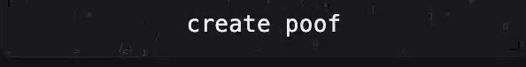

<p align="center">
  <a href="https://p00f.me"></a>
</p>

<h1 align="center">p00f</h1>

<p align="center"><strong>A zero-knowledge, ephemeral clipboard for humans and agents.</strong><br/>
Encrypt something, get a link that self-destructs, hand it off. The server only ever holds ciphertext.</p>

<p align="center">
  <a href="https://p00f.me"></a>
</p>

<p align="center">
  <a href="https://www.npmjs.com/package/@p00f/core"></a>
  <a href="LICENSE"></a>
  
</p>

---

p00f is a live app at **[p00f.me](https://p00f.me)**. Paste text, code, a file, an image, or a secret; it is encrypted on your device; you get a short-lived link; you hand it over; it disappears. Every poof burns on a timer or after a set number of reveals. The infrastructure only ever sees ciphertext.

It is also fully open source, and for a zero-knowledge tool that is the whole point: you should not have to take our word for it. The code that does the encrypting is right here, so you can read exactly what happens to your data.

## Use it

Go to **[p00f.me](https://p00f.me)**, drop in what you want to share, choose how long it lives and how many times it can be opened, and share the link. That is the entire flow:

<p align="center">
  
</p>

A lone URL can be shared as a masked link, and text, code, images, video, and audio render right on the reveal page.

## Open source on purpose

A zero-knowledge promise is only as good as your ability to check it. "Trust us, we cannot read your data" is not worth much when the source is closed. p00f's is open, so you (or your security team) can verify the claims instead of believing them:

- The encryption happens caller-side with the Web Crypto API. The whole engine is `src/shared/` (`crypto.ts`, `link.ts`, `protocol.ts`, `core.ts`).
- The decryption key is generated locally and lives in the URL fragment (`#...`), which browsers never send over the network.
- The Worker and Durable Object in `src/worker/` store and serve ciphertext, and never receive the key.

Don't trust, verify. We would still rather you just use [p00f.me](https://p00f.me); the source is here so the zero-knowledge claim is auditable, not because you need to host anything.

## Hand secrets to agents without leaking them

Pasting an API key, token, or password straight into an agent chat is a bad habit. That text tends to get logged, retained in history, synced to a provider, and sometimes used for training. p00f is the basic, boring fix:

```sh
# point the CLI at the hosted app (see "From your terminal or your agent" below)
export POOF_BASE=https://p00f.me

# poof the secret, get a link
$ printf '%s' "$OPENAI_API_KEY" | poof --ttl 1h --reads 1
https://p00f.me/c/q8Zr2nF1#3sP_Kb...the-key-stays-in-the-fragment

# hand that link to your agent. it reveals the secret exactly once, then it burns.
```

The agent reveals it through its own `poof` MCP server or CLI, so decryption happens on the agent's side and the hosted API only ever relays ciphertext. Because a default poof needs no human captcha to reveal ([ADR-0015](docs/adr/0015-optional-reveal-turnstile.md)), a headless agent can open it; for a sensitive secret the creator can require a PIN, cap it to a single reveal, or turn on a human captcha that keeps it browser-only.

> A poof is not a vault. It is a courier that forgets. If a recipient (human or agent) is allowed to see the plaintext, assume they can copy it. p00f controls how long and how often a poof can be revealed, not what happens after. The trust model is spelled out honestly in [`SECURITY.md`](SECURITY.md).

## How it works

A poof link looks like `https://p00f.me/c/<id>#<key>`. The `<id>` addresses the ciphertext on the server; the part after `#` is the secret half (the key), and it never leaves your client.

```mermaid
sequenceDiagram
    autonumber
    participant C as Creator
    participant S as p00f server
    participant R as Recipient
    Note over C: browser, CLI, or agent
    C->>C: generate a random key, encrypt content locally
    C->>S: upload ciphertext only
    S->>S: store in a per-clip Durable Object (TTL alarm + atomic reveal budget)
    S-->>C: clip id
    C->>C: build link p00f.me/c/{id}#{key}
    Note over C,R: the #{key} fragment never touches the server
    C->>R: hand over the link
    R->>S: fetch ciphertext for {id}
    S->>S: spend one reveal; burn when the budget hits zero
    S-->>R: ciphertext
    R->>R: decrypt locally with the key from the #fragment
```

The recipient sees the plaintext. The infrastructure never does. Here is the same split, by what each side ever holds:

```text
   YOUR DEVICE / YOUR AGENT                  p00f SERVERS (Worker + DO)
   what stays here, always                   what they ever hold
   .......................                   ....................
   the plaintext content                     ciphertext (an opaque blob)
   the decryption key                        a random 128-bit clip id
   the exact size, filename, and kind        a coarse size bucket
   the URL #fragment (it carries the key)    reveals remaining
                                             whether a PIN / captcha is required
                                             a TTL, to run the burn

      the key lives in the link's #fragment and is never sent to the
      server, so p00f physically cannot decrypt what it stores.
```

Revealed content renders inside a sandboxed, opaque-origin iframe, so a hostile payload in a poof cannot reach back out and steal the key from the page ([ADR-0012](docs/adr/0012-hostile-rendering-key-isolation.md)).

## From your terminal or your agent

The web app is the easy path. For scripts and agents, the same poofs are created and revealed over the shared `@p00f/core` engine, pointed at p00f.me.

### CLI

Build the CLI from this repo, then point it at the hosted app:

```sh
npm install
npm run build:cli
npm link                          # puts `poof` (and `poof-mcp`) on your PATH
export POOF_BASE=https://p00f.me  # otherwise the CLI talks to a local dev server

# create from a file or stdin. stdout is the link, and only the link.
poof secrets.env
cat debug.log | poof --ttl 1h --reads 3

# reveal, inspect without spending a reveal, and burn early
poof get  https://p00f.me/c/ID#KEY
poof info https://p00f.me/c/ID#KEY      # non-consuming
poof burn https://p00f.me/c/ID#KEY --token OWNER_TOKEN
```

stdout is the link only, so `LINK=$(poof report.md)` composes cleanly. The owner token needed to burn early goes to stderr, or use `--json`. Flags include `--ttl`, `--reads`, `--pin`, `--require-turnstile`, `--no-countdown`, and `--out FILE`.

### MCP (agents)

Build the MCP server (`npm run build:mcp`) and register it with your agent:

```jsonc
{
  "mcpServers": {
    "poof": {
      "command": "node",
      "args": ["/absolute/path/to/bin/poof-mcp.mjs"],
      "env": { "POOF_BASE": "https://p00f.me" }
    }
  }
}
```

Tools: `poof_create`, `poof_read`, `poof_info` (non-consuming), `poof_burn`. Decryption happens in the local server, so the hosted API only ever sees ciphertext. A `secret`-kind poof requires `confirm: true` before it is revealed into the model context. Agents that just want the library can `npm install @p00f/core` and call it directly; a remote MCP facade could only ever relay ciphertext, since a functional read needs the caller-side engine (see [ADR-0010](docs/adr/0010-agent-machine-integration.md)).

## What a creator controls

- **Burns after** a TTL: 5 minutes, 1 hour, 1 day, or 7 days.
- **Or after** N reveals: 1, 3, 10, or unlimited (within the TTL). The counter is atomic in the Durable Object, so concurrent reveals cannot overspend it.
- **PIN or password** (4 to 128 characters), folded into the key derivation. A wrong-PIN lockout (5 attempts) lives in the Durable Object.
- **Reveal captcha** (optional, default off): require a human to pass a challenge before revealing. This is what makes a poof browser-only; leave it off for agent-revealable poofs.
- **Countdown**: the reveal page shows a live fuse and best-effort auto-clears when the deadline passes. This is honest UX, not confidentiality (an already-revealed poof may have been copied).
- **Content cap**: up to 25 MiB per poof.

## What p00f does and does not promise

**Does:** keep plaintext and keys off p00f's servers; enforce a TTL and a reveal budget; lock out PIN guessing per poof; isolate revealed content from the page that holds the key.

**Does not:** stop a recipient who is allowed to see a secret from copying, screenshotting, or re-sharing it; guarantee deletion on a device that already revealed and cached it; act as long-term storage or a password manager. p00f is a courier that forgets, and it is honest about the rest in [`SECURITY.md`](SECURITY.md).

## Run your own (optional)

You do not need to. [p00f.me](https://p00f.me) is the app, and it is the easiest way to make and share poofs. The source is here for transparency, not because hosting is required.

If you do want your own instance, it runs on Cloudflare's free plan: create the R2 bucket (`CLOUDFLARE_ACCOUNT_ID=<id> wrangler r2 bucket create poof-content`), set a real `TURNSTILE_SECRET` (`wrangler secret put TURNSTILE_SECRET`), keep the `CREATE_LIMIT` rate-limit binding in `wrangler.jsonc`, and `wrangler deploy`.

## Develop

```sh
npm install
npm run dev          # builds the client and starts wrangler dev
npm test             # vitest under @cloudflare/vitest-pool-workers
```

The web app (`src/client/`), CLI (`src/cli/`), and MCP server (`src/mcp/`) are thin shells over the shared engine in `src/shared/`; the Worker and Durable Object live in `src/worker/`. See [`CONTEXT.md`](CONTEXT.md) for the vocabulary and [`docs/adr/`](docs/adr/) for the decisions behind the design. The hero banner above is generated from [`docs/hero/banner.html`](docs/hero/banner.html).

## Status

Alpha, and live at [p00f.me](https://p00f.me). The zero-knowledge engine is published as [`@p00f/core`](https://www.npmjs.com/package/@p00f/core). Issues and contributions are welcome under the [MIT License](LICENSE).
