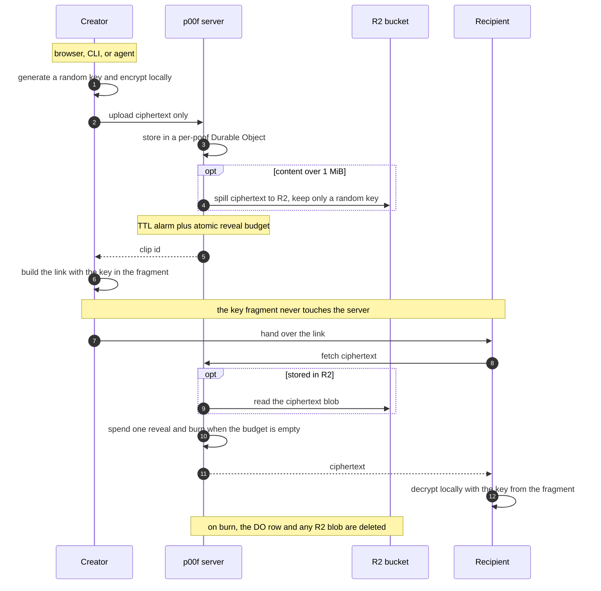

# Security

p00f is a zero-knowledge, ephemeral clipboard and agent-handoff tool. This document states plainly what is and is not protected, so you can trust it for the right things.

## Trust model

- **Zero-knowledge.** Every Clip is encrypted in the caller (browser or CLI) with AES-GCM-256 before upload. The decryption key (the Fragment Key) lives only in the URL fragment (`#...`), which clients never send to a server. The hosted API, Cloudflare, and anyone who breaches storage only ever hold ciphertext. See `docs/adr/0001-zero-knowledge-trust-model.md`.
- **The Link is the secret.** Possession of the full Link (the clip id in the path plus the Fragment Key in the fragment) is what decrypts a Clip. Treat a Link like a password.
- **Ephemeral by default.** A Clip burns when its TTL expires or its reveal budget reaches zero, whichever comes first (`docs/adr/0002-clip-lifecycle.md`).
- **One core, many shells.** The same audited crypto runs in the web app and the `poof` CLI. The hosted API is a ciphertext-only relay (`docs/adr/0010-agent-machine-integration.md`).

## Data flow

A poof link looks like `https://p00f.me/c/<id>#<key>`. The `<id>` addresses the ciphertext on the server; the part after `#` is the key, and it never leaves your client.

## What is NOT protected

- **The recipient sees plaintext.** Anyone you give the Link to (a person, an agent, or the LLM behind that agent) can read the content. That is the point of a handoff. Zero-knowledge protects the content from the storage operator, not from the recipient.
- **Lose the Link and it is gone.** There is no recovery. The server cannot help; it has no key.
- **The PIN/password is access control, not confidentiality.** An optional variable-length PIN or password (4 to 128 chars) gates server-side release of the content and is folded into the content key. It protects a leaked Link from being revealed, but it is not what keeps the content secret (the Fragment Key is). See `docs/adr/0004-pin-model.md`.
- **Coarse size is observable.** Ciphertext length approximates content size, and content over roughly 1 MB is stored in R2. The exact content is never readable, but a size bucket is (`docs/adr/0003-content-model.md`).

## Operator notes

- The only Turnstile secret committed to this repository is Cloudflare's public always-pass test key, which is safe. A real deployment sets its real secret with `wrangler secret put TURNSTILE_SECRET` and never commits it.
- Abuse control on the machine path is an in-repo rate-limit floor (`docs/adr/0011-machine-path-abuse-control.md`), enforced per data center. It is a floor, not a hard global cap; Cloudflare network DDoS protection sits underneath.
- Large content (over about 1 MiB) is stored in R2 as ciphertext only; the Fragment Key never reaches it, so R2 holds an opaque blob exactly like the Durable Object (`docs/adr/0006-storage-and-limits.md`). An R2 object is written at create, served on reveal, and deleted when the poof burns. That burn-time delete is best-effort, so a bucket lifecycle rule on `poof-content` deletes any object after 65 days as a backstop, longer than the maximum lifetime of any poof; even a missed delete leaves only key-less ciphertext.
- Revealed content must be rendered as hostile to protect the key from an XSS-in-a-Clip (`docs/adr/0012-hostile-rendering-key-isolation.md`).
